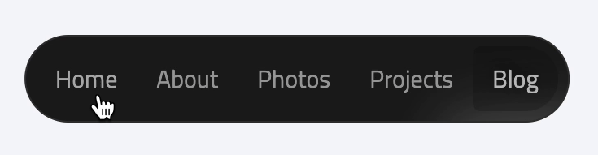

# Shiny Navbar
*A navbar component built with React ⚛️ + TypeScript\
Inspired by [Rauno Freiberg](https://rauno.me/)'s craft.*



## Tech Stack
- React
- TypeScript
- SCSS
- Framer Motion

## Demo
For demo, you can go this [CodeSandbox](https://codesandbox.io/s/magical-wilson-0jkkbs?file=/src/App.tsx)

## How to use?

Get the package with,
```shell
npm install shiny-navbar
```
or
```shell
yarn add shiny-navbar
```

We have a prop for now, it named **items**

**items**, contains the menu items and actions. Required interface is on below.

```typescript jsx
interface NavbarItem {
  customClass?: string
  label: string
  onPerform?(event, item, itemIndex): void
  url?: string
}
```

- __customClass__, gives custom extra class to item.
- __label__, holds the visible string for item.
- __onPerform__, is a simple onClick event.
- __url__ is for extra onClick handler. If item has **url**, it goes on new tab.

Call it on your project:

```typescript jsx
import React from "react";
import { ShinyNavbar } from "shiny-navbar";
import 'shiny-navbar/dist/shiny-navbar.css';

const App = () => {
    const config: NavbarItem[] = [
        {
            label: "Nav1",
            onPerform() {
                console.log("Nav1 is triggered!");
            },
        },
        {
            label: "Nav2",
            onPerform() {
                console.log("Nav2 is triggered!");
            },
            url: "https://google.com",
        },
        {
            label: "Nav3",
            onPerform(
                event: React.MouseEvent<HTMLButtonElement, MouseEvent>,
                item: NavbarItem,
                itemIndex: number
            ) {
                console.log({ event, item, itemIndex });
            },
            customClass: "green-text",
        },
        {
            label: "Nav4",
            onPerform(
                event: React.MouseEvent<HTMLButtonElement, MouseEvent>,
                item: NavbarItem,
                itemIndex: number
            ) {
                console.log({ event, item, itemIndex });
            },
        },
    ];
  
  return <div>
    <ShinyNavbar items={config} />
  </div>
}
```
